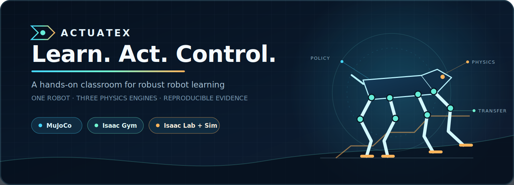
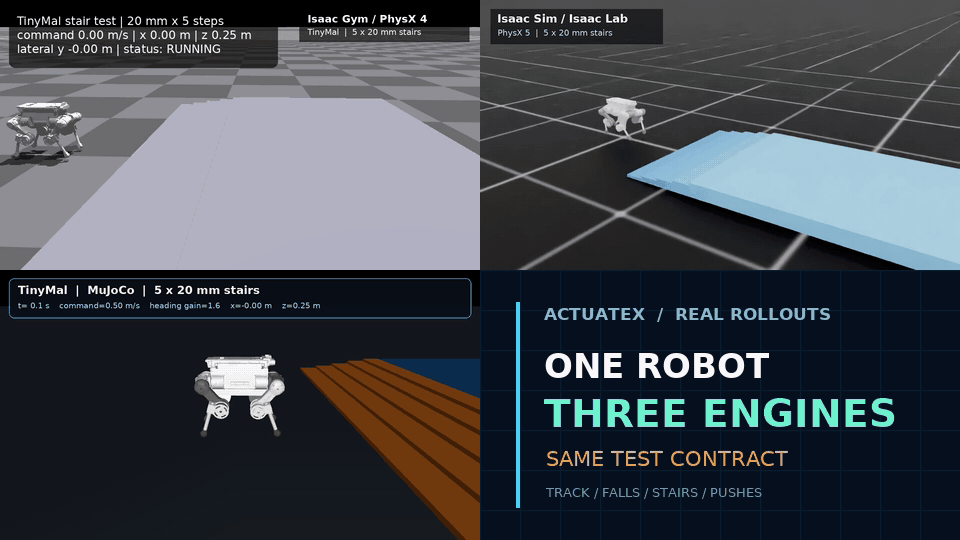
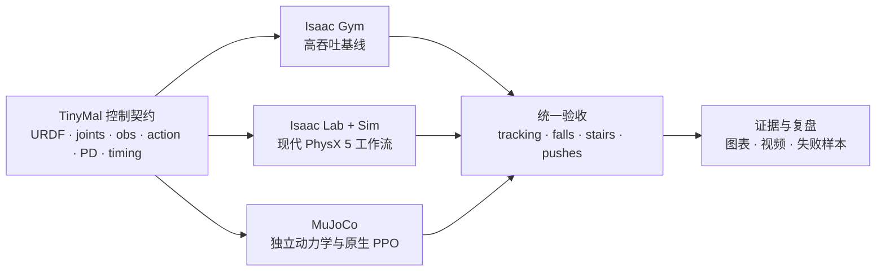
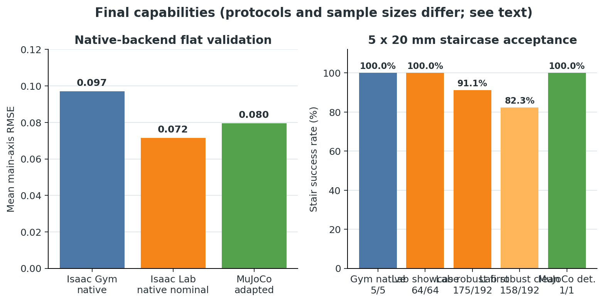
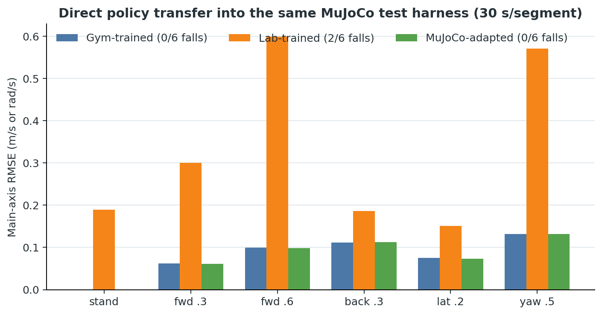
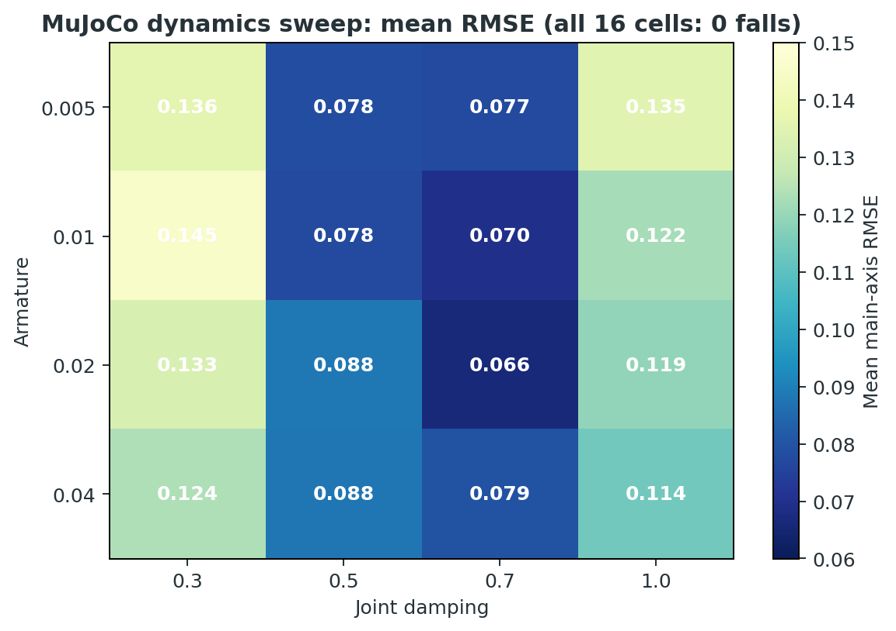

<div align="center">



<br />

<a href="https://github.com/Functionhx/actuatex/actions/workflows/repository-checks.yml"></a>
<a href="https://github.com/Functionhx/actuatex"></a>
<a href="https://github.com/Functionhx/actuatex/commits/main"></a>


<p><strong>让 TinyMal 在一个模拟器里学会走路，再去另外两个物理世界接受检验。</strong></p>
<p>一个面向强化学习控制教学的三后端实验室：从站稳、行走、抗扰、上台阶，到双向 sim2sim。</p>

<p>
  <a href="#quick-start">快速开始</a> ·
  <a href="#learning-path">课程路线</a> ·
  <a href="#experiments">实验结果</a> ·
  <a href="#code-tour">代码导读</a> ·
  <a href="./docs/CODE_CHANGES_REPORT.zh-CN.md">修改报告</a>
</p>

</div>

> **训练 reward 是起点，不是结论。** ActuateX 更关心策略能否在陌生动力学、持续外力、楼梯和另一套物理引擎里继续站住并完成命令。

<a id="demo"></a>

## 🐕 同一只机器狗，三个物理世界

<div align="center">
  
  <sub>真实实验画面：Isaac Gym / PhysX 4 · Isaac Lab + Isaac Sim / PhysX 5 · MuJoCo</sub>
</div>

ActuateX 不是把三份启动脚本放在一起。三个后端共享一份可审计的 TinyMal 控制契约：**12 个关节、48 维观测、12 维动作、50 Hz 策略频率、统一 PD 目标与统一验收指标**。只有这些语义都对齐，跨模拟器比较才有意义。

<table>
  <tr>
    <td width="50%" valign="top">
      <h3>🧠 学算法，不背命令</h3>
      <p>从 PPO、奖励、课程学习，到域随机化、策略蒸馏和对称性约束；每一步都能找到对应代码与实验。</p>
    </td>
    <td width="50%" valign="top">
      <h3>🔬 结果必须能被反驳</h3>
      <p>成功视频之外，同时保留失败段、跌倒数、RMSE、动力学网格和推力矩阵，不用一条 reward 曲线代替结论。</p>
    </td>
  </tr>
  <tr>
    <td width="50%" valign="top">
      <h3>🔁 一次学习，三次验证</h3>
      <p>Isaac Gym 做高吞吐基线，Isaac Lab 学现代机器人栈，MuJoCo 负责独立复现、原生训练和 sim2sim 交叉检查。</p>
    </td>
    <td width="50%" valign="top">
      <h3>🧩 大仓库也能读得懂</h3>
      <p>不搬运模拟器源码。仓库只保存任务、算法、配置、补丁和评估工具，让每一处修改都可定位、可复现、可审阅。</p>
    </td>
  </tr>
</table>

<a id="why-three"></a>

## 🛰️ 为什么需要三套模拟器？

它们不是同一个产品的三个名字，也没有“越新就一定训得越好”这种简单关系。

| 后端 | 最适合学什么 | ActuateX 中的角色 | 运行特点 |
|---|---|---|---|
| **MuJoCo** | 动力学、执行器、奖励和 PPO 的最小闭环 | 原生训练、楼梯/推力验收、双向 sim2sim | 可从 CPU 开始；最容易调试 |
| **Isaac Gym / PhysX 4** | 大规模并行采样与经典腿足基线 | 4096 环境训练、鲁棒任务族、蒸馏、离屏录制 | 旧版独立 GPU 模拟器；吞吐高 |
| **Isaac Lab + Isaac Sim / PhysX 5** | 当前 NVIDIA 机器人工作流与复杂场景 | 原生 Manager-Based 任务、对称性、Gym 策略迁移 | Lab 是训练框架，Sim 是运行时与模拟器 |

如果你第一次接触机器人强化学习，建议按 **MuJoCo → Isaac Gym → Isaac Lab → sim2sim** 学；如果你已经有 NVIDIA 环境，可以从 Gym 基线开始，再用 Lab 和 MuJoCo 检验迁移。



<a id="quick-start"></a>

## 🚀 第一条可运行路径：从 MuJoCo 开始

不需要先安装 NVIDIA 模拟器。下面这条路径会完成依赖固定、模型站立检查和 1 次 PPO 迭代；**它验证训练链路，不代表已经得到可用策略**。

```bash
git clone https://github.com/Functionhx/actuatex.git
cd actuatex

git clone https://github.com/leggedrobotics/rsl_rl.git _deps/rsl_rl
git -C _deps/rsl_rl checkout 2ad79cf0caa85b91721abfe358105f869a784121

python -m pip install -r backends/mujoco/requirements.txt
python -m pip install -e _deps/rsl_rl

python backends/mujoco/test_stand.py
python backends/mujoco/train_mujoco.py --num_envs 4 --max_iters 1
```

看到站立高度稳定、PPO 完成一次更新后，再把环境数和迭代数提高到正式配置：

```bash
python backends/mujoco/train_mujoco.py \
  --num_envs 64 --max_iters 1500 \
  --learning_rate 3e-4 --command_mode omni
```

<details>
<summary><strong>⚡ Isaac Gym：高吞吐基线与鲁棒训练</strong></summary>

先单独安装 NVIDIA Isaac Gym Preview 4，然后固定并集成上游代码：

```bash
git clone https://github.com/unitreerobotics/unitree_rl_gym.git _deps/unitree_rl_gym
git -C _deps/unitree_rl_gym checkout 276801e46c5d433564f24658bac64f254b7d2d4b

git clone https://github.com/leggedrobotics/rsl_rl.git _deps/rsl_rl
git -C _deps/rsl_rl checkout 2ad79cf0caa85b91721abfe358105f869a784121

python scripts/install_isaac_gym_overlay.py \
  --unitree-root _deps/unitree_rl_gym \
  --rsl-rl-root _deps/rsl_rl
python -m pip install -e _deps/rsl_rl -e _deps/unitree_rl_gym
```

先做 4 环境、1 迭代冒烟检查，再开始正式训练：

```bash
python _deps/unitree_rl_gym/legged_gym/scripts/train.py \
  --task=tinymal --headless --num_envs=4 --max_iterations=1

python _deps/unitree_rl_gym/legged_gym/scripts/train.py \
  --task=tinymal --headless --num_envs=4096
```

任务族和评估命令见 [Isaac Gym 后端指南](./backends/isaac_gym/README.md)。

</details>

<details>
<summary><strong>🟢 Isaac Lab + Isaac Sim：现代 PhysX 5 工作流</strong></summary>

先按官方方式安装匹配的 Isaac Sim / Isaac Lab，再固定本项目测试过的 Isaac Lab 提交：

```bash
git clone https://github.com/isaac-sim/IsaacLab.git _deps/IsaacLab
git -C _deps/IsaacLab checkout b4c321024792976150ca55fddb26fa34480d974e

python scripts/install_isaac_lab_compat.py --isaac-lab-root _deps/IsaacLab
export ISAAC_SIM_PYTHON=/path/to/isaac-sim/python.sh
```

```bash
"$ISAAC_SIM_PYTHON" backends/isaac_lab/scripts/train_tinymal.py \
  --task Isaac-Velocity-Native-Omni-TinyMal-v0 \
  --num_envs 4096 --max_iterations 1500 \
  --headless --seed 1
```

版本说明、旧 Gym 策略迁移和录制命令见 [Isaac Lab / Isaac Sim 后端指南](./backends/isaac_lab/README.md)。

</details>

<details>
<summary><strong>🎬 MuJoCo：评估、专项验收与楼梯视频</strong></summary>

```bash
python backends/mujoco/eval_mujoco.py \
  --checkpoint artifacts/checkpoints/mujoco/model.pt \
  --out_dir artifacts/mujoco/evaluation

python backends/mujoco/eval_mujoco_tasks.py \
  --checkpoint artifacts/checkpoints/mujoco/model.pt \
  --out_dir artifacts/mujoco/tasks

MUJOCO_GL=egl python backends/mujoco/record_mujoco_stairs.py \
  --checkpoint artifacts/checkpoints/mujoco/model.pt \
  --output artifacts/videos/tinymal_mujoco_stairs.mp4
```

录制器会把“到顶、保持居中、保持直立”作为硬门槛，失败时返回非零状态。完整说明见 [MuJoCo 后端指南](./backends/mujoco/README.md)。

</details>

<a id="learning-path"></a>

## 🧭 从“站住”到“跨世界”：课程路线

这套仓库可以直接拆成 7 次实验。每一章都有一个明确问题、一个应读入口和一个可提交产物。

| Lab | 核心问题 | 建议入口 | 实验产物 |
|---:|---|---|---|
| **0 · 认识机器狗** | 关节顺序、坐标系、PD 和控制频率是什么？ | [`tinymal.urdf`](./robots/tinymal/urdf/tinymal.urdf)、[`test_stand.py`](./backends/mujoco/test_stand.py) | 关节映射 + 5 秒站立检查 |
| **1 · 让它走起来** | PPO 如何把速度命令变成 12 维关节目标？ | [`tinymal_config.py`](./backends/isaac_gym/overlay/legged_gym/envs/tinymal/tinymal_config.py) | 训练曲线 + 平地 rollout |
| **2 · 不要一推就倒** | 域随机化和外力课程如何提高恢复能力？ | [`tinymal_robust.py`](./backends/isaac_gym/overlay/legged_gym/envs/tinymal/tinymal_robust.py) | 推力矩阵 + 失败边界 |
| **3 · 学会上台阶** | 为什么平地策略通常不会自然学会楼梯？ | [`tinymal_stairs.py`](./backends/isaac_gym/overlay/legged_gym/envs/tinymal/tinymal_stairs.py) | 课程设置 + 成功/失败对照视频 |
| **4 · 搬到新框架** | 同样的网络为何在 Isaac Lab 中表现不同？ | [`mdp.py`](./backends/isaac_lab/tinymal_lab/mdp.py)、[`tinymal_cfg.py`](./backends/isaac_lab/tinymal_lab/tinymal_cfg.py) | 观测/执行器对齐清单 |
| **5 · 在 MuJoCo 重训** | 求解器、armature、固定学习率为何影响成败？ | [`model_builder.py`](./backends/mujoco/model_builder.py)、[`train_mujoco.py`](./backends/mujoco/train_mujoco.py) | 原生策略 + 超参数消融 |
| **6 · sim2sim 答辩** | “在本模拟器里成功”能否推广？ | [`compare_sim2sim.py`](./tools/sim2sim/compare_sim2sim.py) | 六段命令、跌倒率、RMSE 与结论 |

教师可以把每一章的“实验产物”直接作为验收项；学习者也可以只选一个后端入门，再逐步打开迁移与鲁棒性章节。

<a id="experiments"></a>

## 📊 实验不是成功学：展示结果，也保留失败



<table>
  <tr>
    <td width="50%"></td>
    <td width="50%"></td>
  </tr>
  <tr>
    <td align="center"><sub>统一六段命令的 sim2sim 对比</sub></td>
    <td align="center"><sub>MuJoCo 动力学扰动网格</sub></td>
  </tr>
</table>

| 最终验收项 | 结果 | 怎么读 |
|---|---:|---|
| Isaac Gym → MuJoCo，六段命令 | **mean RMSE 0.08024 · 0/6 falls** | 当前最稳定的跨引擎基线 |
| Isaac Lab → MuJoCo，六段命令 | **mean RMSE 0.33272 · 2/6 falls** | PhysX 5 到 MuJoCo 仍有明显系统差异 |
| MuJoCo 原生策略，六段命令 | **mean RMSE 0.07957 · 0/6 falls** | 原生 PPO 链路可得到稳定步态 |
| MuJoCo 动力学组合 | **16/16 no-fall** | 质量、摩擦等组合扰动下未跌倒 |
| MuJoCo 持续外力 | **11/16 accepted** | 强推力与不利方向仍是薄弱点 |
| Isaac Lab 原生楼梯展示 | **64/64 success** | 仅代表展示设置，不等同严格随机测试 |

我们故意保留 Isaac Lab → MuJoCo 的 2 次跌倒。它比“只放最好看的 checkpoint”更有教学价值：同一维度的网络输入，不代表坐标系、接触、执行器和求解器语义真的一致。

推荐按四层证据写实验结论：

1. **训练层**：reward、KL、entropy、学习率是否正常；
2. **原生层**：命令跟踪、跌倒、姿态和动作是否合格；
3. **压力层**：台阶、摩擦/质量变化和持续外力的边界在哪里；
4. **迁移层**：换一套物理引擎后，哪些能力保留、哪些能力消失。

<a id="code-tour"></a>

## 🧩 代码导读：想改什么，就从哪里进去

| 你想研究的问题 | 首先阅读 | 接着阅读 |
|---|---|---|
| 48 维观测到底是什么 | [`observation_builder.py`](./backends/mujoco/observation_builder.py) | [`tools/sim2sim/observation_builder.py`](./tools/sim2sim/observation_builder.py) |
| 动作如何变成关节力矩 | [`tinymal_config.py`](./backends/isaac_gym/overlay/legged_gym/envs/tinymal/tinymal_config.py) | [`tinymal_cfg.py`](./backends/isaac_lab/tinymal_lab/tinymal_cfg.py) |
| MuJoCo URDF 为什么会塌 | [`model_builder.py`](./backends/mujoco/model_builder.py) | [`test_stand.py`](./backends/mujoco/test_stand.py) |
| PPO 和学习率怎么配置 | [`train_mujoco.py`](./backends/mujoco/train_mujoco.py) | [`rsl_rl_native_ppo_cfg.py`](./backends/isaac_lab/tinymal_lab/agents/rsl_rl_native_ppo_cfg.py) |
| 如何做鲁棒性训练 | [`tinymal_robust.py`](./backends/isaac_gym/overlay/legged_gym/envs/tinymal/tinymal_robust.py) | [`tinymal_robust_env_cfg.py`](./backends/isaac_lab/tinymal_lab/tinymal_robust_env_cfg.py) |
| 如何避免新任务遗忘旧步态 | [`0003-reference-policy-distillation.patch`](./backends/isaac_gym/patches/0003-reference-policy-distillation.patch) | [`train_tinymal_robust_transfer.py`](./backends/isaac_gym/overlay/legged_gym/scripts/train_tinymal_robust_transfer.py) |
| 如何公平比较 checkpoint | [`compare_checkpoints.py`](./tools/checkpoints/compare_checkpoints.py) | [`compare_sim2sim.py`](./tools/sim2sim/compare_sim2sim.py) |
| Lab 与 Gym 到底改了什么 | [`CODE_CHANGES_REPORT.zh-CN.md`](./docs/CODE_CHANGES_REPORT.zh-CN.md) | [`ActuateX_代码修改报告.pdf`](./docs/ActuateX_代码修改报告.pdf) |

完整设计见 [架构说明](./docs/ARCHITECTURE.md)，适合答辩或代码评审的版本见 [代码修改报告](./docs/CODE_CHANGES_REPORT.zh-CN.md)。

<a id="repository-map"></a>

## 🗺️ 仓库地图

```text
actuatex/
├── backends/
│   ├── isaac_gym/       # TinyMal 覆盖层、任务族和可审计上游补丁
│   ├── isaac_lab/       # 原生 Isaac Lab 环境、算法配置和脚本
│   └── mujoco/          # 模型构建、向量环境、原生 PPO 与验收
├── robots/tinymal/      # 唯一的机器人 URDF、mesh 与资产声明
├── tools/
│   ├── checkpoints/     # checkpoint 对比与权重融合
│   └── sim2sim/         # 策略加载、观测对齐和跨引擎评估
├── scripts/             # 有版本检查、可重复执行的集成安装器
├── docs/                # 架构、实验图和代码修改报告
└── artifacts/           # 本地生成；日志、模型、视频，不进入 Git
```

大型依赖放在被忽略的 `_deps/`，训练产物放在被忽略的 `artifacts/`。这样 Git 历史只包含真正需要审阅的源码、配置和补丁，不把 Isaac Sim、Isaac Gym、checkpoint 或训练日志塞进仓库。

<details>
<summary><strong>🖥️ 环境数与显存：怎样加速而不是只把显存“吃满”</strong></summary>

- Isaac Gym / Isaac Lab 从 `1024` 或 `2048` 个环境起步，观察 steps/s 与显存，再提高到项目基线的 `4096`；给评估、录制和瞬时分配保留余量。
- “显存占用 100%”不是优化目标。更重要的是 GPU 利用率、仿真吞吐、PPO 更新时间和是否发生 OOM/系统交换。
- MuJoCo 后端当前把向量仿真与 PPO 放在 CPU；优先调 `--num_envs` 与 `--num_threads`，盲目增加 GPU 显存不会让 MuJoCo 物理步进变快。
- 每次扩容后先运行短基准，确认单位迭代时间确实下降，再进行 1500 iterations 的正式训练。

</details>

<a id="roadmap"></a>

## 🛠️ Roadmap

- [x] Isaac Gym、Isaac Lab / Isaac Sim、MuJoCo 三套原生训练与评估链路
- [x] 平地、楼梯、域随机化、持续外力和离屏视频录制
- [x] Gym / Lab → MuJoCo 与 MuJoCo → Gym 的双向 sim2sim 工具
- [x] 策略蒸馏、checkpoint 硬门槛筛选和代码修改报告
- [ ] 缩小 Isaac Lab → MuJoCo 的执行器与接触差异
- [ ] 加入历史观测策略、特权信息教师与在线适应
- [ ] 发布不含受限资产的 checkpoint / benchmark Release
- [ ] 在执行器标定、延迟、急停与跌倒保护完成后探索真机部署

欢迎提交可复现的环境适配、失败案例、消融实验和验收指标。提交前建议运行：

```bash
python -m compileall -q backends tools scripts
python scripts/verify_repo.py
```

## 📚 引用与致谢

如果 ActuateX 对课程、实验或研究有帮助，可以这样引用：

```bibtex
@software{actuatex2026,
  title  = {ActuateX: A Multi-Simulator Classroom for Robust Robot Learning},
  author = {ActuateX Contributors},
  year   = {2026},
  url    = {https://github.com/Functionhx/actuatex}
}
```

ActuateX 建立在 [RSL-RL](https://github.com/leggedrobotics/rsl_rl)、[Unitree RL Gym](https://github.com/unitreerobotics/unitree_rl_gym)、[Isaac Lab](https://github.com/isaac-sim/IsaacLab)、[Isaac Sim](https://developer.nvidia.com/isaac/sim) 和 [MuJoCo](https://github.com/google-deepmind/mujoco) 之上。感谢这些项目对机器人学习社区的贡献。

## ⚖️ 许可证与资产说明

本仓库不分发 NVIDIA 模拟器二进制。上游版本、补丁来源和许可证见 [`THIRD_PARTY.md`](./THIRD_PARTY.md) 与 [`third_party/licenses/`](./third_party/licenses/)。TinyMal 模型来自课程材料，公开再分发前请先阅读 [`ASSET_NOTICE.md`](./robots/tinymal/ASSET_NOTICE.md)。

**当前尚未声明项目级开源许可证。** 公开可读不等于自动授予复制、修改或再分发权；在许可证确定前，请将本仓库用于审阅与课程复现，并分别遵守上游软件和机器人资产条款。

---

<div align="center">
  <strong>Learn the dynamics. Challenge the policy. Control with evidence.</strong><br />
  <sub>ActuateX · Learn. Act. Control.</sub>
</div>
