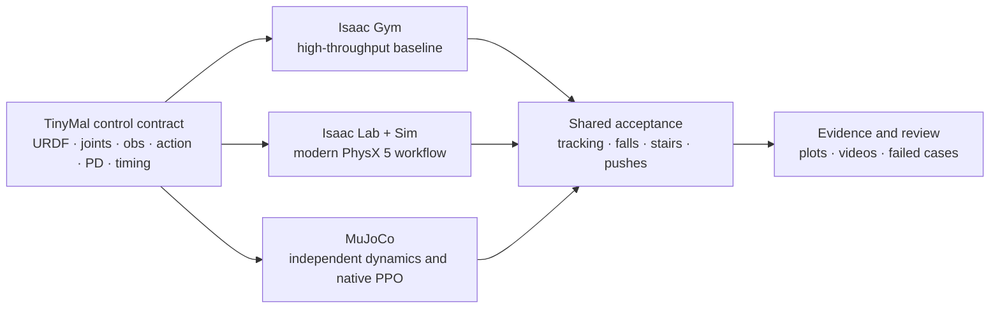

<div align="center">


<br />

<p><a href="./README.md">简体中文</a> · <strong>English</strong></p>

<a href="https://github.com/Functionhx/actuatex/actions/workflows/repository-checks.yml"></a>
<a href="https://github.com/Functionhx/actuatex"></a>
<a href="https://github.com/Functionhx/actuatex/commits/main"></a>


<a href="./LICENSE"></a>

<p><strong>Teach TinyMal to walk in one simulator, then make it prove itself in two other physics worlds.</strong></p>
<p>An open, three-backend classroom for reinforcement-learning control: standing, locomotion, disturbance recovery, stair climbing, and bidirectional sim2sim.</p>

<p>
  <a href="#quick-start">Quick Start</a> ·
  <a href="#learning-path">Learning Path</a> ·
  <a href="#experiments">Experiments</a> ·
  <a href="#code-tour">Code Tour</a> ·
  <a href="./docs/CODE_CHANGES_REPORT.zh-CN.md">Change Report</a>
</p>

</div>

> **Training reward is the starting point, not the conclusion.** ActuateX asks whether a policy can still follow commands under unfamiliar dynamics, sustained pushes, stairs, and a different physics engine.

<a id="demo"></a>

## 🐕 One robot, three physics worlds

<div align="center">
  
  <sub>Real experiment rollouts: Isaac Gym / PhysX 4 · Isaac Lab + Isaac Sim / PhysX 5 · MuJoCo</sub>
</div>

ActuateX is more than three launch scripts in one repository. All backends share an auditable TinyMal control contract: **12 joints, 48 observations, 12 actions, a 50 Hz policy rate, aligned PD targets, and one acceptance vocabulary**. Cross-simulator results only mean something when these semantics agree.

<table>
  <tr>
    <td width="50%" valign="top">
      <h3>🧠 Learn the algorithm, not the command line</h3>
      <p>Trace PPO, rewards, curricula, domain randomization, policy distillation, and symmetry constraints from idea to code to experiment.</p>
    </td>
    <td width="50%" valign="top">
      <h3>🔬 Results must be falsifiable</h3>
      <p>Alongside successful videos, keep failed segments, fall counts, RMSE, dynamics grids, and push matrices. A reward curve is not the whole conclusion.</p>
    </td>
  </tr>
  <tr>
    <td width="50%" valign="top">
      <h3>🔁 Learn once, verify three times</h3>
      <p>Use Isaac Gym for the high-throughput baseline, Isaac Lab for the modern robotics stack, and MuJoCo for independent reproduction, native training, and sim2sim checks.</p>
    </td>
    <td width="50%" valign="top">
      <h3>🧩 Make large stacks readable</h3>
      <p>Simulator source trees are not copied here. Only tasks, algorithms, configuration, patches, and evaluation tools are kept, so every change remains reviewable.</p>
    </td>
  </tr>
</table>

<a id="why-three"></a>

## 🛰️ Why three simulators?

They are not three names for the same product, and “newer” does not automatically mean “easier to train.”

| Backend | Best concept to learn | Role in ActuateX | Runtime character |
|---|---|---|---|
| **MuJoCo** | The smallest complete loop for dynamics, actuators, rewards, and PPO | Native training, stair/push acceptance, bidirectional sim2sim | Starts on CPU; easiest to debug |
| **Isaac Gym / PhysX 4** | Massive parallel sampling and classic legged-RL baselines | 4096-env training, robust task family, distillation, off-screen recording | Legacy standalone GPU simulator; high throughput |
| **Isaac Lab + Isaac Sim / PhysX 5** | The current NVIDIA robotics workflow and richer scenes | Native Manager-Based tasks, symmetry, Gym-policy migration | Lab is the learning framework; Sim is the runtime and simulator |

For a first robotics-RL project, follow **MuJoCo → Isaac Gym → Isaac Lab → sim2sim**. If your NVIDIA stack is already working, begin with the Gym baseline and use Lab plus MuJoCo to challenge transfer.



<a id="quick-start"></a>

## 🚀 First runnable path: start with MuJoCo

You do not need an NVIDIA simulator for this path. The commands pin dependencies, check standing stability, and run one PPO iteration. **This verifies the pipeline; it does not produce a trained policy.**

```bash
git clone https://github.com/Functionhx/actuatex.git
cd actuatex

git clone https://github.com/leggedrobotics/rsl_rl.git _deps/rsl_rl
git -C _deps/rsl_rl checkout 2ad79cf0caa85b91721abfe358105f869a784121

python -m pip install -r backends/mujoco/requirements.txt
python -m pip install -e _deps/rsl_rl

python backends/mujoco/test_stand.py
python backends/mujoco/train_mujoco.py --num_envs 4 --max_iters 1
```

Once the standing height is stable and PPO completes an update, move to the full training configuration:

```bash
python backends/mujoco/train_mujoco.py \
  --num_envs 64 --max_iters 1500 \
  --learning_rate 3e-4 --command_mode omni
```

<details>
<summary><strong>⚡ Isaac Gym: high-throughput baseline and robust training</strong></summary>

Install NVIDIA Isaac Gym Preview 4 separately, then pin and integrate the upstream projects:

```bash
git clone https://github.com/unitreerobotics/unitree_rl_gym.git _deps/unitree_rl_gym
git -C _deps/unitree_rl_gym checkout 276801e46c5d433564f24658bac64f254b7d2d4b

git clone https://github.com/leggedrobotics/rsl_rl.git _deps/rsl_rl
git -C _deps/rsl_rl checkout 2ad79cf0caa85b91721abfe358105f869a784121

python scripts/install_isaac_gym_overlay.py \
  --unitree-root _deps/unitree_rl_gym \
  --rsl-rl-root _deps/rsl_rl
python -m pip install -e _deps/rsl_rl -e _deps/unitree_rl_gym
```

Run a four-environment, one-iteration smoke test before full training:

```bash
python _deps/unitree_rl_gym/legged_gym/scripts/train.py \
  --task=tinymal --headless --num_envs=4 --max_iterations=1

python _deps/unitree_rl_gym/legged_gym/scripts/train.py \
  --task=tinymal --headless --num_envs=4096
```

See the [Isaac Gym backend guide](./backends/isaac_gym/README.md) for the task family and evaluation commands.

</details>

<details>
<summary><strong>🟢 Isaac Lab + Isaac Sim: modern PhysX 5 workflow</strong></summary>

Install a matching Isaac Sim / Isaac Lab stack through the official process, then pin the Isaac Lab revision tested by this project:

```bash
git clone https://github.com/isaac-sim/IsaacLab.git _deps/IsaacLab
git -C _deps/IsaacLab checkout b4c321024792976150ca55fddb26fa34480d974e

python scripts/install_isaac_lab_compat.py --isaac-lab-root _deps/IsaacLab
export ISAAC_SIM_PYTHON=/path/to/isaac-sim/python.sh
```

```bash
"$ISAAC_SIM_PYTHON" backends/isaac_lab/scripts/train_tinymal.py \
  --task Isaac-Velocity-Native-Omni-TinyMal-v0 \
  --num_envs 4096 --max_iterations 1500 \
  --headless --seed 1
```

See the [Isaac Lab / Isaac Sim backend guide](./backends/isaac_lab/README.md) for version details, old Gym-policy transfer, and recording commands.

</details>

<details>
<summary><strong>🎬 MuJoCo: evaluation, task acceptance, and stair video</strong></summary>

```bash
python backends/mujoco/eval_mujoco.py \
  --checkpoint artifacts/checkpoints/mujoco/model.pt \
  --out_dir artifacts/mujoco/evaluation

python backends/mujoco/eval_mujoco_tasks.py \
  --checkpoint artifacts/checkpoints/mujoco/model.pt \
  --out_dir artifacts/mujoco/tasks

MUJOCO_GL=egl python backends/mujoco/record_mujoco_stairs.py \
  --checkpoint artifacts/checkpoints/mujoco/model.pt \
  --output artifacts/videos/tinymal_mujoco_stairs.mp4
```

The recorder treats reaching the top, remaining centered, and staying upright as hard gates; a failed rollout returns a non-zero status. See the [MuJoCo backend guide](./backends/mujoco/README.md) for details.

</details>

<a id="learning-path"></a>

## 🧭 From standing to cross-world transfer: learning path

The repository can be taught as seven labs. Each lab has one concrete question, an entry point in the code, and a deliverable.

| Lab | Core question | Suggested entry | Deliverable |
|---:|---|---|---|
| **0 · Meet the robot** | What are joint order, frames, PD control, and control frequency? | [`tinymal.urdf`](./robots/tinymal/urdf/tinymal.urdf), [`test_stand.py`](./backends/mujoco/test_stand.py) | Joint map + five-second standing check |
| **1 · Make it walk** | How does PPO map a velocity command to 12 joint targets? | [`tinymal_config.py`](./backends/isaac_gym/overlay/legged_gym/envs/tinymal/tinymal_config.py) | Training curve + flat rollout |
| **2 · Survive a push** | How do domain randomization and force curricula improve recovery? | [`tinymal_robust.py`](./backends/isaac_gym/overlay/legged_gym/envs/tinymal/tinymal_robust.py) | Push matrix + failure boundary |
| **3 · Climb stairs** | Why does a flat-ground policy rarely discover stairs on its own? | [`tinymal_stairs.py`](./backends/isaac_gym/overlay/legged_gym/envs/tinymal/tinymal_stairs.py) | Curriculum + success/failure video pair |
| **4 · Move frameworks** | Why does the same network behave differently in Isaac Lab? | [`mdp.py`](./backends/isaac_lab/tinymal_lab/mdp.py), [`tinymal_cfg.py`](./backends/isaac_lab/tinymal_lab/tinymal_cfg.py) | Observation/actuator alignment checklist |
| **5 · Retrain in MuJoCo** | Why do solver choice, armature, and fixed learning rate matter? | [`model_builder.py`](./backends/mujoco/model_builder.py), [`train_mujoco.py`](./backends/mujoco/train_mujoco.py) | Native policy + hyperparameter ablation |
| **6 · Defend with sim2sim** | Does success in the training simulator generalize? | [`compare_sim2sim.py`](./tools/sim2sim/compare_sim2sim.py) | Six commands, fall rate, RMSE, conclusion |

An instructor can use the deliverable column directly as an acceptance checklist. A learner can begin with one backend and unlock transfer and robustness chapters gradually.

<a id="experiments"></a>

## 📊 Experiments are not success theater


<table>
  <tr>
    <td width="50%"></td>
    <td width="50%"></td>
  </tr>
  <tr>
    <td align="center"><sub>Sim2sim comparison under the shared six-command suite</sub></td>
    <td align="center"><sub>MuJoCo dynamics perturbation grid</sub></td>
  </tr>
</table>

| Final acceptance item | Result | Interpretation |
|---|---:|---|
| Isaac Gym → MuJoCo, six commands | **mean RMSE 0.08024 · 0/6 falls** | Most stable cross-engine baseline so far |
| Isaac Lab → MuJoCo, six commands | **mean RMSE 0.33272 · 2/6 falls** | A visible PhysX 5-to-MuJoCo system gap remains |
| Native MuJoCo policy, six commands | **mean RMSE 0.07957 · 0/6 falls** | Native PPO produces a stable gait |
| MuJoCo dynamics combinations | **16/16 no-fall** | No falls across combined mass/friction perturbations |
| MuJoCo sustained pushes | **11/16 accepted** | Strong and unfavorable force directions remain weak |
| Native Isaac Lab stair showcase | **64/64 success** | Showcase condition only, not strict randomized acceptance |

The two Isaac Lab → MuJoCo falls are kept deliberately. They teach more than a cherry-picked checkpoint: matching tensor dimensions does not guarantee aligned frames, contacts, actuators, or solver semantics.

Build conclusions from four layers of evidence:

1. **Training**: are reward, KL, entropy, and learning rate healthy?
2. **Native rollout**: are tracking, falls, posture, and actions acceptable?
3. **Stress test**: where are the limits under stairs, mass/friction shifts, and sustained pushes?
4. **Transfer**: which capabilities survive another physics engine, and which disappear?

<a id="code-tour"></a>

## 🧩 Code tour: start from the question you want to answer

| Research question | Read first | Continue with |
|---|---|---|
| What exactly are the 48 observations? | [`observation_builder.py`](./backends/mujoco/observation_builder.py) | [`tools/sim2sim/observation_builder.py`](./tools/sim2sim/observation_builder.py) |
| How do actions become joint torques? | [`tinymal_config.py`](./backends/isaac_gym/overlay/legged_gym/envs/tinymal/tinymal_config.py) | [`tinymal_cfg.py`](./backends/isaac_lab/tinymal_lab/tinymal_cfg.py) |
| Why did the imported MuJoCo URDF collapse? | [`model_builder.py`](./backends/mujoco/model_builder.py) | [`test_stand.py`](./backends/mujoco/test_stand.py) |
| Where are PPO and learning rate configured? | [`train_mujoco.py`](./backends/mujoco/train_mujoco.py) | [`rsl_rl_native_ppo_cfg.py`](./backends/isaac_lab/tinymal_lab/agents/rsl_rl_native_ppo_cfg.py) |
| How is robustness trained? | [`tinymal_robust.py`](./backends/isaac_gym/overlay/legged_gym/envs/tinymal/tinymal_robust.py) | [`tinymal_robust_env_cfg.py`](./backends/isaac_lab/tinymal_lab/tinymal_robust_env_cfg.py) |
| How can a new task retain an old gait? | [`0003-reference-policy-distillation.patch`](./backends/isaac_gym/patches/0003-reference-policy-distillation.patch) | [`train_tinymal_robust_transfer.py`](./backends/isaac_gym/overlay/legged_gym/scripts/train_tinymal_robust_transfer.py) |
| How are checkpoints compared fairly? | [`compare_checkpoints.py`](./tools/checkpoints/compare_checkpoints.py) | [`compare_sim2sim.py`](./tools/sim2sim/compare_sim2sim.py) |
| What changed between Lab and Gym? | [`CODE_CHANGES_REPORT.zh-CN.md`](./docs/CODE_CHANGES_REPORT.zh-CN.md) | [`ActuateX_代码修改报告.pdf`](./docs/ActuateX_代码修改报告.pdf) |

See the [architecture note](./docs/ARCHITECTURE.md) for the full design and the [code change report](./docs/CODE_CHANGES_REPORT.zh-CN.md) for a presentation-ready review of project modifications.

<a id="repository-map"></a>

## 🗺️ Repository map

```text
actuatex/
├── backends/
│   ├── isaac_gym/       # TinyMal overlay, task family, auditable upstream patches
│   ├── isaac_lab/       # native Isaac Lab environments, algorithm configs, scripts
│   └── mujoco/          # model builder, vector env, native PPO, acceptance tests
├── robots/tinymal/      # canonical URDF, meshes, and asset notice
├── tools/
│   ├── checkpoints/     # checkpoint comparison and weight blending
│   └── sim2sim/         # policy loading, observation alignment, transfer evaluation
├── scripts/             # guarded, repeatable upstream integration installers
├── docs/                # architecture, experiment figures, change report
└── artifacts/           # local-only logs, models, and videos; excluded from Git
```

Large upstream projects belong in ignored `_deps/` checkouts, and runtime outputs belong in ignored `artifacts/`. Git history therefore contains reviewable source, configuration, and patches—not Isaac Sim, Isaac Gym, checkpoints, or training logs.

<details>
<summary><strong>🖥️ Environment count and VRAM: accelerate training instead of merely filling memory</strong></summary>

- Begin Isaac Gym / Isaac Lab runs with `1024` or `2048` environments, observe steps/s and VRAM, then scale toward the `4096`-environment baseline while leaving room for evaluation, recording, and transient allocations.
- A 100% VRAM reading is not the objective. GPU utilization, simulator throughput, PPO update time, OOM risk, and host swapping matter more.
- The current MuJoCo backend runs vectorized simulation and PPO on CPU. Tune `--num_envs` and `--num_threads`; allocating more GPU memory will not accelerate MuJoCo physics steps.
- Run a short benchmark after every scale change and confirm that iteration time improves before committing to 1500 iterations.

</details>

<a id="roadmap"></a>

## 🛠️ Roadmap

- [x] Native training and evaluation paths for Isaac Gym, Isaac Lab / Isaac Sim, and MuJoCo
- [x] Flat ground, stairs, domain randomization, sustained pushes, and off-screen video
- [x] Bidirectional Gym / Lab → MuJoCo and MuJoCo → Gym sim2sim tools
- [x] Policy distillation, hard-gated checkpoint selection, and a code change report
- [ ] Narrow the Isaac Lab → MuJoCo actuator and contact gap
- [ ] Add history-based policies, privileged teachers, and online adaptation
- [ ] Publish checkpoint / benchmark releases without restricted assets
- [ ] Explore hardware only after actuator calibration, latency, emergency-stop, and fall-protection validation

Reproducible backend integrations, failed cases, ablations, and acceptance metrics are welcome. Before submitting a change, run:

```bash
python -m compileall -q backends tools scripts
python scripts/verify_repo.py
```

## 📚 Citation and acknowledgements

If ActuateX helps your course, experiment, or research, cite it as:

```bibtex
@software{actuatex2026,
  title  = {ActuateX: A Multi-Simulator Classroom for Robust Robot Learning},
  author = {ActuateX Contributors},
  year   = {2026},
  url    = {https://github.com/Functionhx/actuatex}
}
```

ActuateX builds on [RSL-RL](https://github.com/leggedrobotics/rsl_rl), [Unitree RL Gym](https://github.com/unitreerobotics/unitree_rl_gym), [Isaac Lab](https://github.com/isaac-sim/IsaacLab), [Isaac Sim](https://developer.nvidia.com/isaac/sim), and [MuJoCo](https://github.com/google-deepmind/mujoco). We thank their maintainers and communities.

## ⚖️ License and asset terms

Original ActuateX source code and documentation are released under the [MIT License](./LICENSE). You may use, modify, and distribute them while retaining the copyright and permission notice.

This repository does not redistribute NVIDIA simulator binaries. Upstream versions, patch provenance, and licenses are documented in [`THIRD_PARTY.md`](./THIRD_PARTY.md) and [`third_party/licenses/`](./third_party/licenses/). Third-party software, compatibility patches, and the course-supplied TinyMal model remain subject to their own terms; the MIT License cannot grant rights ActuateX does not own. Read [`ASSET_NOTICE.md`](./robots/tinymal/ASSET_NOTICE.md) before copying or redistributing the robot assets.

---

<div align="center">
  <strong>Learn the dynamics. Challenge the policy. Control with evidence.</strong><br />
  <sub>ActuateX · Learn. Act. Control.</sub>
</div>
