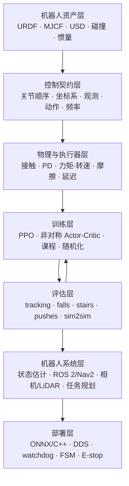

# ActuateX 工业化全栈强化学习仿真

## 目标

ActuateX 的目标不再只是“在某个模拟器里训出一段能看的步态”，而是建立一条可审计、可复现、可跨引擎、最终可接真实机器人运行时的控制链。机器狗是主线，人形机器人以 Unitree G1 29-DOF 为第一条扩展线；轮腿与 RoboMaster 级机构沿用同一套接口。

这里的“接近工业界”主要体现在边界清楚，而不是网络更大：训练时可以使用大规模并行和特权信息，部署时只能依赖真实可获得的传感器；策略输出必须经过执行器模型、限幅、延迟和安全状态机；任何成功率都必须在另一套物理引擎和扰动矩阵中复核。

## 七层架构

### 1. 机器人资产层

- 机器狗：保留 TinyMal 教学模型，同时引入许可证明确、具有真实参数来源的工业机器人模型。
- 人形：先做 G1 29-DOF。资产来自官方 Unitree 仓库，仓库只记录固定 commit，不复制大型上游仓库。
- 每个资产必须审计质量、惯量、关节轴、关节限位、碰撞几何和足底接触；视觉上相似不算动力学数字孪生。

### 2. 控制契约层

同一机器人只允许一份后端无关契约。至少固定：

- 硬件 SDK 关节顺序及每个后端到该顺序的显式 permutation；
- body/world 坐标约定、四元数顺序、重力投影和速度命令语义；
- 每个观测项的缩放、裁剪、噪声、历史长度及展平顺序；
- 动作含义、PD 目标、控制周期、decimation、力矩与速度限制；
- reset、termination、成功判据及统一随机种子。

G1 第一版已经固化为 29 维动作、96 维单帧观测、5 帧 term-major 历史、480 维 actor 输入和 50 Hz 策略频率。代码在 [`tasks/locomotion/g1_29dof.py`](../tasks/locomotion/g1_29dof.py)。

### 3. 物理与执行器层

只用理想位置驱动会高估策略能力。正式训练与验收需要逐步加入：

- 电机方向相关的力矩—转速包络；
- 静摩擦、黏性摩擦、armature、传动间隙和热降额近似；
- 观测/动作延迟、丢包、IMU bias、编码器量化；
- 质量、质心、惯量、摩擦、恢复系数和接触求解器随机化；
- 电池电压、负载和地面材料的分层测试。

随机化必须围绕可解释的 nominal twin，而不是用极宽噪声掩盖错误模型。

### 4. 训练层

腿足主基线使用 PPO/RSL-RL，因为它在大规模 on-policy 接触任务上成熟、稳定且方便做非对称 actor-critic。后续算法不是无目的堆榜单：

- teacher 使用高度图、接触和真实动力学参数等特权信息；
- student 只接收真机可用的历史观测，通过蒸馏或 adaptation 学习隐变量；
- 左右对称约束降低样本量并减少偏步；
- 地形、速度、推力、延迟按课程逐步扩大；
- SAC/TD3 保留在低维任务和残差控制实验中，不直接假设其必然优于 PPO；
- locomotion policy 下方仍保留 PD/WBC，上方保留命令整形和导航，RL 不独占整套控制系统。

### 5. 双引擎验收层

Isaac Lab/PhysX 负责 GPU 大规模训练、复杂场景和 RTX 传感器；MuJoCo 负责独立动力学复核、快速调试、CI 级短回放和反向 sim2sim。正式结论至少包含：

- 同一初始状态和命令下的 tracking RMSE；
- 跌倒率、存活时间、足滑、能耗、关节/力矩饱和率；
- 台阶、坡面、随机地形、持续推力和组合动力学扰动；
- Isaac→MuJoCo、MuJoCo→Isaac 两个方向，而非只选有利方向；
- 多随机种子、失败样本和置信区间。

### 6. 感知与机器人系统层

低层步态策略接收局部速度/姿态命令，不直接承担整套导航。系统层采用 ROS 2：

- IMU、关节、足端接触进入状态估计；
- MID360、相机进入定位、建图和障碍物层；
- Nav2 或自研局部规划器输出限速后的 `vx/vy/yaw`；
- Isaac Sim 用 RTX 传感器做高保真数据，Gazebo 插件保留兼容验证；
- 每条传感链都验证时间戳、坐标树、噪声、运动畸变和吞吐，不只验证外观。

### 7. 部署与安全层

导出物不仅是 `policy.onnx`，还要同时生成带 hash 的契约清单：关节表、缩放、历史布局、PD、频率、限幅和训练版本。C++ 运行时负责固定周期推理、SDK/DDS 映射、命令插值和记录回放；独立 supervisor 负责 stale-state watchdog、姿态/关节/速度检查、渐进启停和切回阻尼/站立状态。

这里提供的是研究级安全护栏，不替代硬件 E-stop、厂商安全状态机、隔离区和现场风险评估。

## 已完成、正在做、尚未完成

| 范围 | 当前证据 | 状态 |
|---|---|---|
| TinyMal 三后端训练与双向 sim2sim | 训练、台阶、推力、视频与失败样本 | 已完成基线 |
| 1/2/3 阶倒立摆传统控制与 RL | MuJoCo/Isaac 同口径矩阵、PPO/SAC/TD3 | 已完成阶段矩阵 |
| 串联轮腿 | Isaac Sim 6 场景、共享 URDF/MJCF、初始 sim2sim | 进行中 |
| ROS 2 导航与 MID360/相机链 | 消息、点云模式、Nav2 配置、RTX 校验脚本 | 进行中 |
| G1 官方 Isaac 资产启动 | 4 env × 1 iteration PPO 冒烟 | 已验证链路，不代表步态完成 |
| G1 29-DOF 工业契约 | 关节/观测/动作/电机/延迟/安全测试 | 已完成第一版 |
| G1 29-DOF 双后端正式训练 | Isaac 与 MuJoCo 原生策略、双向 sim2sim | 尚未完成 |
| 真实机部署 | ONNX/C++/DDS 回放、台架、吊架、自由行走 | 尚未授权且尚未完成 |

## 下一阶段验收门槛

1. 用官方 G1 29-DOF 资产在 Isaac Lab 注册 ActuateX 任务，4 环境冒烟后再扩至显存实测甜点。
2. 以同一 SDK 顺序和 480 维观测在官方 MuJoCo twin 注册原生环境。
3. 分别训练 Isaac 与 MuJoCo PPO，不用单向迁移结果冒充双端完成。
4. 跑固定命令、随机命令、推力、摩擦/质量/延迟矩阵和双向 sim2sim。
5. 导出 ONNX + contract hash，先做软件在环与 DDS 回放；没有真机授权时不进入电机上电阶段。
